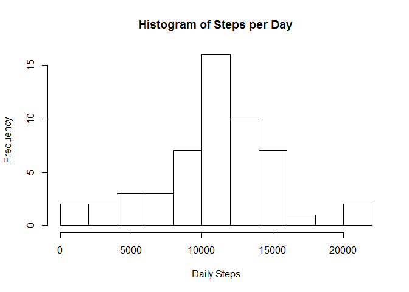
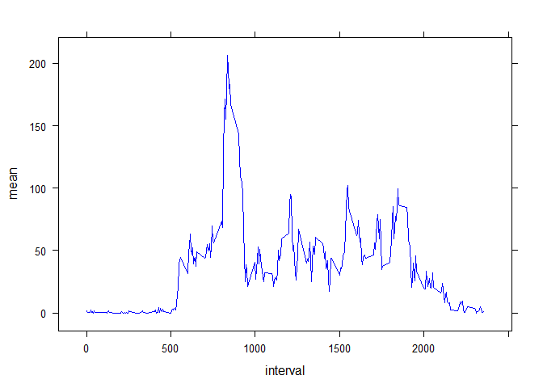
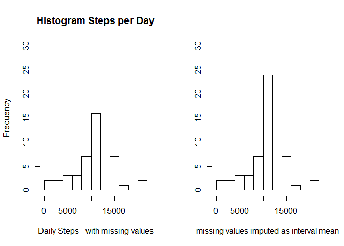
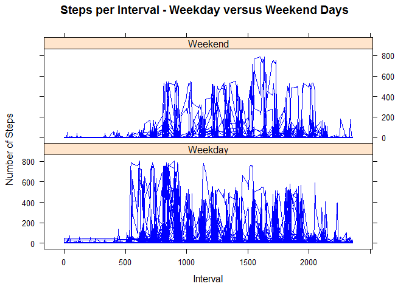

# Reproducable Research Project 1

####  Libaries used:

```r
library(data.table)
library(lattice)


setwd("C:/bnc/Coursera/Reproducable Research/Project 1")
```


### Read and process the incoming data.


```r
# Read  the base data rows
stepdata <- read.csv("activity.csv",header=TRUE)

# Reformat date
stepdata$date  <- as.Date(stepdata$date, format="%Y-%m-%d")
stepdata$intvl <- as.factor(stepdata$interval)
```


### Calculate "total steps per day"" and present in a histogram.

```r
# Calculate the total number of steps per day
Dailysteps <- aggregate(stepdata$steps, list(date=stepdata$date), na.rm=FALSE, sum)
names(Dailysteps) = c("date","steps")  # Rename the default "x" variable

# Make a histogram of the total number of steps taken each day
hist(Dailysteps$steps
     , breaks=10
     ,main="Histogram of Steps per Day"
     ,xlab="Daily Steps"
     )
```



### Calculate and report Mean and Median steps per day:

```r
# Calculate and report the mean and median of the total number of steps taken per day
meanDailySteps <- mean(Dailysteps$steps, na.rm=TRUE)
medianDailySteps <- median(Dailysteps$steps, na.rm=TRUE)
mnds <- format(meanDailySteps, digits=2, nsmall=0, big.mark=",")
mdds <- format(medianDailySteps, digits=2, nsmall=0, big.mark=",")
```
Mean daily steps: 10,766  
Median daily steps: 10,765  

  
    
### Time series plot of average Steps per Day by interval.


```r
# Calculate the total number of steps per interval (regardless of day)
meandt <- data.table(stepdata)[,list(mean=mean(as.numeric(steps), na.rm=TRUE)
                              ,No_of_obs=length(steps)
)
,by=list(interval)]
meandf <- data.frame(meandt)

# Make a time series plot (i.e. type = "l") of the 5-minute interval (x-axis)
#   and the average number of steps taken, averaged across all days (y-axis)

xyplot(mean ~ interval,
        data = meandf,
        type = "l",
        lty = c(1, 2, 2, 1),
        lwd = 1,
        col.line = c("blue")
)
```



### Find the interval with the maximum number of steps

```r
# Which 5-minute interval, on average across all the days in the dataset, 
#  contains the maximum number of steps?

maxInterval <- meandf$interval[which.max(meandf$mean)]
maxintvl    <- format(maxInterval, digits=2, nsmall=0, big.mark=",")
```

The time series interval with the maximum steps per day is: 835

***
### Missing data.


```r
# Calculate and report the total number of missing values
stepNAs <- with(stepdata,ftable(is.na(steps)))[2]
mvals <- format(stepNAs, digits=2, nsmall=0, big.mark=",")
```

The number of missing values in the data set is: 2,304


***


### Filling in missing values 
We will now impute values for missing intervals by replacing each missing value with its corresponding mean steps for that interval across all days.


```r
# Previously we had calculated the total number of steps per interval 
#   (regardless of day) in the meandf data frame

# From the previously calculated means by interval in the meandf data frame:
#    bind its columns into a new "imputed" data frame by interval
imputed <- cbind(stepdata,meandf)

# Assign a new "impsteps" var with the current steps value as the default
imputed$impsteps <- imputed$steps

# Update only the NA's with the integer value of the mean
imputed$impsteps[is.na(imputed$impsteps)] <- as.integer(imputed$mean[is.na(imputed$impsteps)])

# Reaggregate by day
ImpDailysteps <- aggregate(imputed$impsteps,
        list(date=imputed$date), na.rm=FALSE, sum)
names(ImpDailysteps) = c("date","impsteps")  # Rename the default "x" variable
```


### Comparing measures with and without imputed values.

Comparing daily steps per day with missing values as NA's with the imputed values we see a difference in the histogram and in the computed mean and median steps per day.

##### Histograms without and with imputed values. 


```r
# Make a histogram of the total number of steps taken each day
#  comparing the original with NA's to the new imputed values
par(mfrow = c(1,2))
hist(Dailysteps$steps
     , breaks=10
     ,main="Histogram Steps per Day"
     ,xlab="Daily Steps - with missing values"
     ,ylim=c(0,30)
     )

hist(ImpDailysteps$impsteps
     , breaks=10
     ,main=""
     ,ylab=""
     ,xlab="missing values imputed as interval mean"
     ,ylim=c(0,30)
)
```




### Comparing the mean and median with and without the imputed missing values


```r
# Recalculate, format  and report the mean and median of 
#  the total number of steps taken per day

# Before imputed values
meanDailySteps   <- mean(Dailysteps$steps, na.rm=TRUE)
meands  <- format(meanDailySteps, digits=2, nsmall=0, big.mark=",")

medianDailySteps <- median(Dailysteps$steps, na.rm=TRUE)
medds  <- format(medianDailySteps, digits=2, nsmall=0, big.mark=",")

# After imputed values:
meanImpDailySteps   <- mean(ImpDailysteps$impsteps, na.rm=TRUE)
meandsi <- format(meanImpDailySteps, digits=2, nsmall=0, big.mark=",")

medianImpDailySteps <- median(ImpDailysteps$impsteps, na.rm=TRUE)
meddsi <- format(medianImpDailySteps, digits=2, nsmall=0, big.mark=",")
```

Mean steps   without imputed values: 10,766 and with 10,750  
Median steps without imputed values: 10,765 and with 10,641

###Investigating weekday versus weekend patterns we find:


```r
# Recode into weekday/weekend
imputed$weekday <- as.factor(weekdays(imputed$date, abbreviate=TRUE))

imputed$weekend[imputed$weekday == "Mon"] <- "Weekday"
imputed$weekend[imputed$weekday == "Tue"] <- "Weekday"
imputed$weekend[imputed$weekday == "Wed"] <- "Weekday"
imputed$weekend[imputed$weekday == "Thu"] <- "Weekday"
imputed$weekend[imputed$weekday == "Fri"] <- "Weekday"
imputed$weekend[imputed$weekday == "Sat"] <- "Weekend"
imputed$weekend[imputed$weekday == "Sun"] <- "Weekend"


xyplot(impsteps ~ interval | weekend,
data = imputed,
 type = "l",
 lty = c(1, 2, 2, 1),
 lwd = c(1, 1, 1, 3),
 main="Steps per Interval - Weekday versus Weekend Days",
 ylab="Number of Steps",
 xlab="Interval",
 layout=(c(1,2)),
 col.line = c("blue")
)
```



In general we see activity in the intervals earlier in the day on weekday days than on weekend days.


